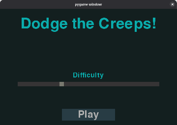
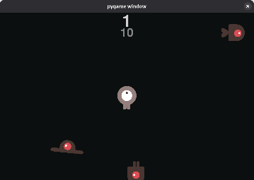

Dodge the Creeps!
==
What is this?
--
This is a game, where you have to dodge enemies that appear at the screen borders. With each creep that you have dodged your score increases.

Why don't you try it yourself? It is written on a Python, so it works with any operating system as long as you have python on it.

How to install it?
--
1. Download the source code
2. Install libraries from requirements.txt
3. Done! Now just run start_screen.py and you can play it

Let's talk a bit about scructure of this game
--
So, this game has 2 scenes: main menu (start screen) and game scene (main cycle). These scenes are created in coresponding files. 

Also, two classes are moved to separate files: Creep class (for enemies that you have to dodge) and Player class (for main hero that you control). 

Besides of that, there is "helpful_functions" file, which contains functions that are used in several different files, and "constatns" that contains all the text, all the colors and figures that are to be drawn in the screen. Constants file contains almost all the parameters which lets you to change games appearance quickly and gives you an ability to easily localise the game. By the way, you can change games resolution there and everything will be scaled corespondingly.

In "data.json" (which will appear later) the only thing that is stored is best score. In "requirements.txt" all needed libraries are listed. And in "art" folder there are all textures for enemies and player.

How does it look like?
--
### Here are some screenshots of this game:
_Main menu of the game_

_Game itself_

